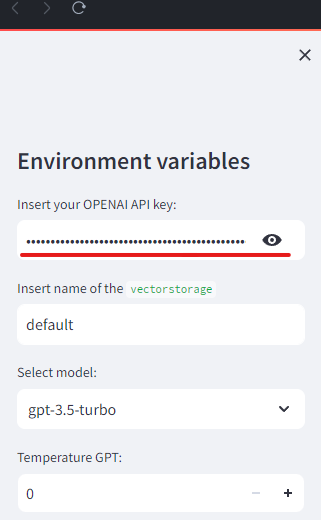
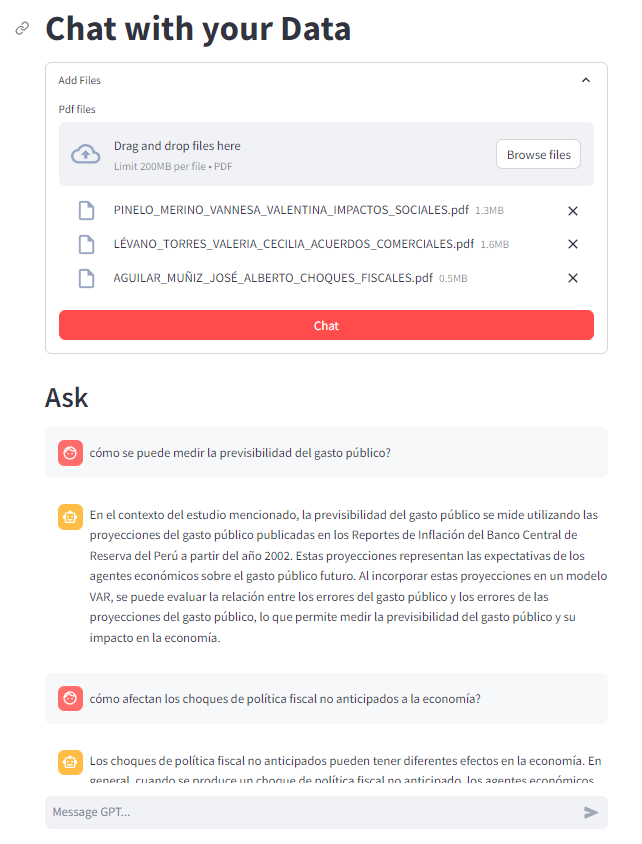

# Prompt_engineering
prompt engineering course based on GPT 

|   | Class                                     | Link                                                                                 |
|---|-------------------------------------------|--------------------------------------------------------------------------------------|
| 1 | Fundamentals for LLM Applications         | https://colab.research.google.com/drive/1A_tAFQxy9roM3OFgm0n6nPEfIdRpwpbG?authuser=1 |
| 2 | Prompt Engineering for LLM Applications   | https://colab.research.google.com/drive/1e_IV-LjsnP_prS4JpOWR17gyLYPOI6ZY?authuser=1 |
| 3 | Building Systems with LLMs                | https://colab.research.google.com/drive/1hC8Crjb-nplVprsSRbE-ML1xQnzpnoeu?usp=sharing|
| 4 | Chat with your Data through LangChain     | https://colab.research.google.com/drive/1AyVZLJ4tshqRseFK2aTx-4gFKjEEJm5V?authuser=1 |
| 5 | LangChain for LLM Application Development | https://colab.research.google.com/drive/1SBK4MmxD-r3wBSS5H754y45gjpDy6zEG?usp=sharing|
| 6 | Building Applications through RAG         |                                                                                      |
| 7 | Recommender Systems - Pinecone                       | [Recomender-system.ipynb](https://colab.research.google.com/github/TJhon/lanchain_curso/blob/day3/Pinecone/recomender_system.ipynb)   |
| 8 | Facial Similarity Search - Pinecone                 | [Facial similarity.ipynb](https://colab.research.google.com/github/TJhon/lanchain_curso/blob/day3/Pinecone/facial_similarity_search.ipynb) |

# Simple Application Setup

To get started with the simple application, follow these steps:

## 1. Clone the Repository

First, clone the repository to your local machine:

```sh
git clone https://github.com/alexanderquispe/prompt_engine prompt_e
cd prompt_e
git checkout streamlit-app
```

## 2. Set Up Python Environment

Ensure you have Python version 3.10 installed. Then, set up the Python environment using Pipenv:

```sh
pip install pipenv
pipenv shell
pipenv install
```

## 3. Configure API Key

Create a `.env` file in the project directory and add your OpenAI API key to it. This file will automatically extract and insert the API key into the environment.

```
.env
OPENAI_API_KEY = "sk-XXXXXXXXXXXXXXXXXXXXXXXXXXXXXXXXXXXXXXXXXXXXXXXX"
```

Alternatively, if you prefer not to create the environment file, you can input the API key directly in the application.



## 4. Run the Application

Finally, run the application using one of the following commands:

```sh
pipenv run streamlit run app.py
# or
streamlit run app.py
```

That's it! You should now have the simple application up and running locally on your machine.

# 5. Preview

